#highload
# Create droplets do

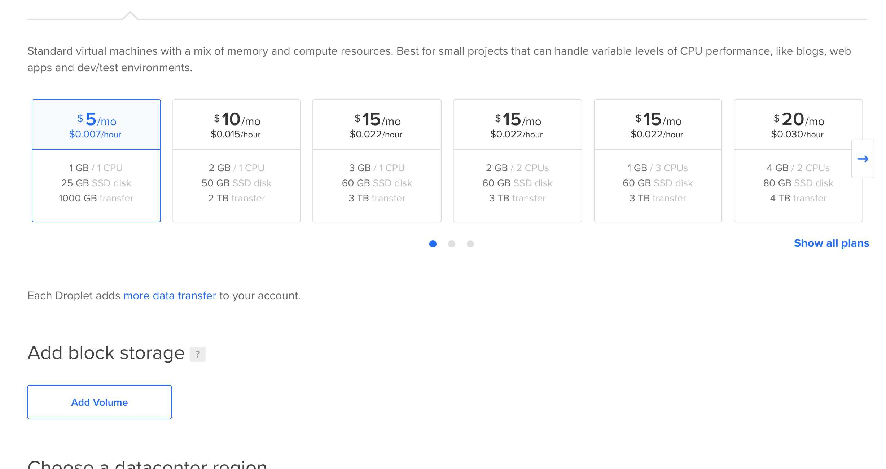
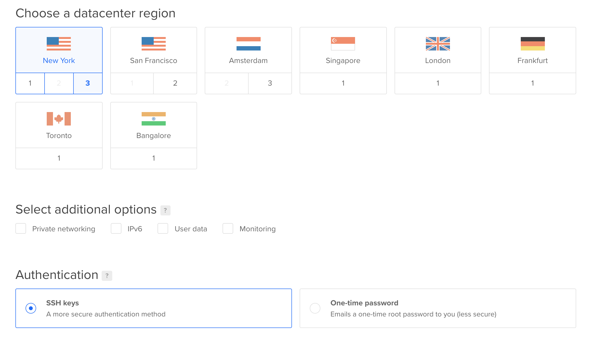
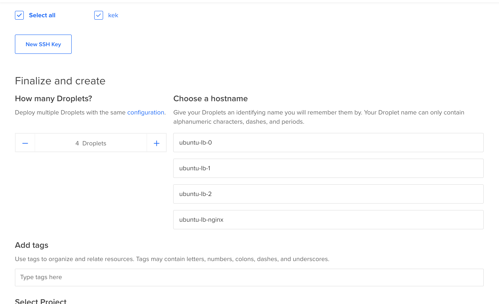
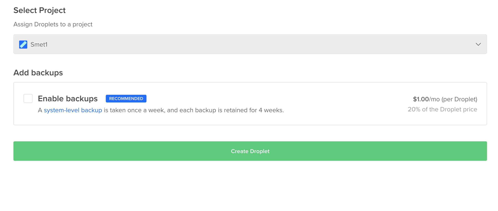
 
# Droplets
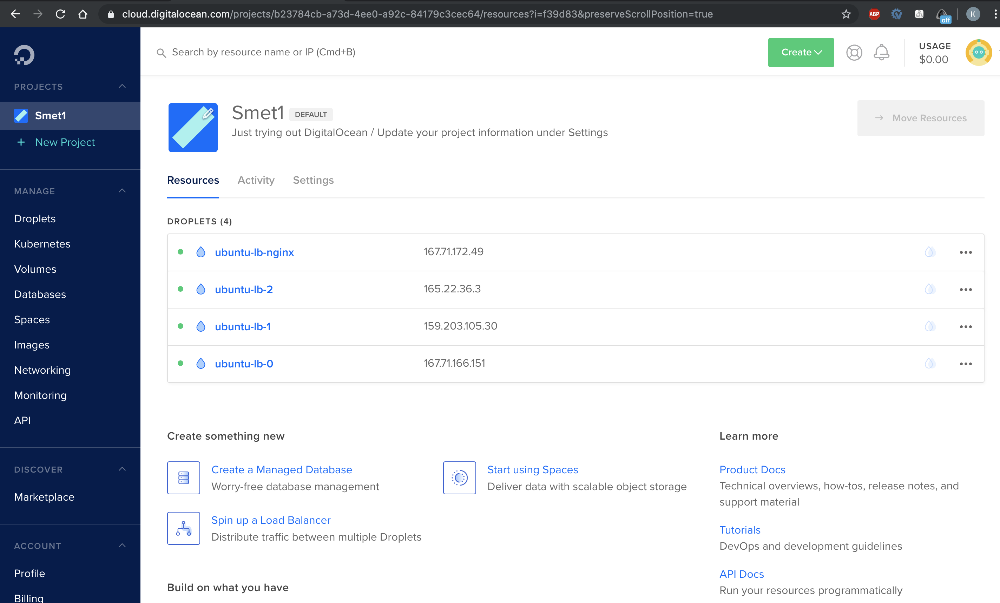

# Optional
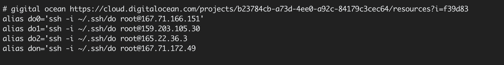

# Prepare
Запускаем на каждой тачке сервер
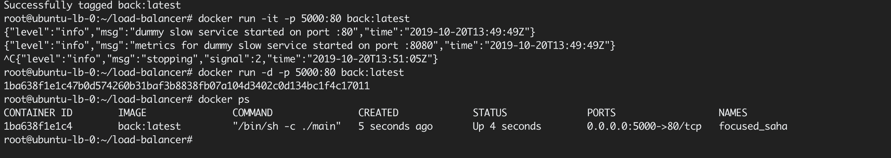

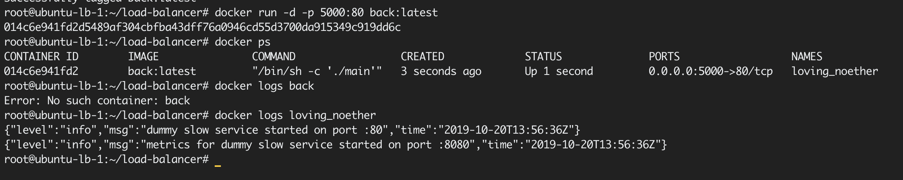

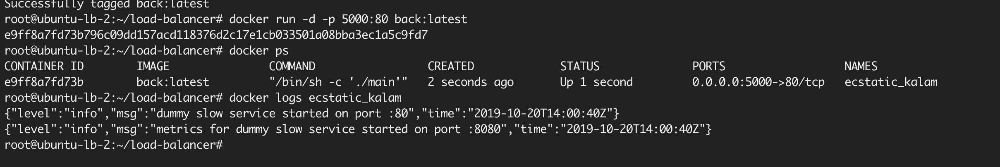

*UPD забыл порт на prometheus* 
```
актуальная команда:
	docker run -d -p 5000:80 -p 8080:8080 back:latest
```


# nginx
## Бэкенды 
Устанавливаем nginx на дроплет бэкендов
[Как установить Nginx в Ubuntu 18.04 | DigitalOcean](https://www.digitalocean.com/community/tutorials/nginx-ubuntu-18-04-ru)

### Конфиг бэкендов

*/etc/nginx/nginx.conf*

```
user www-data;
worker_processes auto;
pid /run/nginx.pid;
include /etc/nginx/modules-enabled/*.conf;

events {
    worker_connections 768;
}

http {
	upstream backend {
        	server 127.0.0.1:5000;
	}

	upstream metrics {
        	server 127.0.0.1:8080;
	}

	server {
		listen 80;
		location /metrics {
			proxy_set_header Host $http_host;
                	proxy_set_header X-Real-IP $remote_addr;
	                proxy_pass http://metrics;
		}

		location / {
                	proxy_set_header Host $http_host;
	                proxy_set_header X-Real-IP $remote_addr;
	                proxy_pass http://backend;
	        }
	}
	##
	# Basic Settings
	##

	sendfile on;
	tcp_nopush on;
	tcp_nodelay on;
	keepalive_timeout 65;
	types_hash_max_size 2048;
	# server_tokens off;

	# server_names_hash_bucket_size 64;
	# server_name_in_redirect off;

	include /etc/nginx/mime.types;
	default_type application/octet-stream;

	##
	# SSL Settings
	##

	ssl_protocols TLSv1 TLSv1.1 TLSv1.2; # Dropping SSLv3, ref: POODLE
	ssl_prefer_server_ciphers on;

	##
	# Logging Settings
	##

	access_log /var/log/nginx/access.log;
	error_log /var/log/nginx/error.log;

	##
	# Gzip Settings
	##

	gzip on;

	# gzip_vary on;
	# gzip_proxied any;
	# gzip_comp_level 6;
	# gzip_buffers 16 8k;
	# gzip_http_version 1.1;
	# gzip_types text/plain text/css application/json application/javascript text/xml application/xml application/xml+rss text/javascript;

	##
	# Virtual Host Configs
	##

	include /etc/nginx/conf.d/*.conf;
	include /etc/nginx/sites-enabled/*;
}
```

## load balancer
Устанавливаем openresty, это nginx с lua
[OpenResty - OpenResty® Linux Packages](http://openresty.org/en/linux-packages.html)

**ставим все под \Ubuntu\**

### Запуск
`sudo fuser -k 80/tcp` - убить процесс на 80 порту
`openresty -t` - проверить валидность конфига
`openresty` - запустить nginx с lua на 80 порту

`cat /var/log/nginx/error.log | tail -200` - последние 200 строк ошибок nginx (работает везде, openresty и nginx)
`cat /var/log/nginx/access.log | tail -200` - последние 200 строк доступов к nginx (также как и в предыдущем пункте) 

### Конфиг балансера

*/usr/local/openresty/nginx/conf/nginx.conf* 

```
user root;
worker_processes auto;
pid /run/nginx.pid;
#include /etc/nginx/modules-enabled/*.conf;

events {
    worker_connections 768;
}

http {
    lua_package_path "/root/lua-resty-upstream-healthcheck/lib/?.lua;;";

    upstream backend {
        server 167.71.166.151 max_fails=2 fail_timeout=10s;
        server 159.203.105.30 max_fails=2 fail_timeout=10s;
        server 165.22.36.3 max_fails=2 fail_timeout=10s;
    }

    lua_shared_dict healthcheck 1m;

    lua_socket_log_errors off;

    init_worker_by_lua_block {
        local hc = require "resty.upstream.healthcheck"

        local ok, err = hc.spawn_checker{
            shm = "healthcheck",  -- defined by "lua_shared_dict"
            upstream = "backend", -- defined by "upstream"
            type = "http",

            http_req = "GET /api/status HTTP/1.0\r\nHost: backend\r\n\r\n",
                    -- raw HTTP request for checking

            interval = 2000,  -- run the check cycle every 2 sec
            timeout = 1000,   -- 1 sec is the timeout for network operations
            fall = 3,  -- # of successive failures before turning a peer down
            rise = 2,  -- # of successive successes before turning a peer up
            valid_statuses = {200},  -- a list valid HTTP status code
            concurrency = 10,  -- concurrency level for test requests
        }
        if not ok then
            ngx.log(ngx.ERR, "failed to spawn health checker: ", err)
           --  return
        end

        -- Just call hc.spawn_checker() for more times here if you have
        -- more upstream groups to monitor. One call for one upstream group.
        -- They can all share the same shm zone without conflicts but they
        -- need a bigger shm zone for obvious reasons.
    }

    server {
        listen 80;
        location / {
            proxy_set_header Host $http_host;
            proxy_set_header X-Real-IP $remote_addr;
            proxy_pass http://backend;
	    proxy_next_upstream error timeout invalid_header http_500 http_502 http_503 http_504;
	    proxy_next_upstream_timeout 0;
            proxy_next_upstream_tries 2;

	    # content_by_lua_block {
            #   --  local hc = require "resty.upstream.healthcheck"
            #   -- ngx.say("Nginx Worker PID: ", ngx.worker.pid())
            #   --  ngx.print(hc.status_page())
            # }
        }
	location /info-get123 {
	    content_by_lua_block {
                local hc = require "resty.upstream.healthcheck"
            	ngx.say("Nginx Worker PID: ", ngx.worker.pid())
            	ngx.print(hc.status_page())
            }
	}
    }


    sendfile on;
    tcp_nopush on;
    tcp_nodelay on;
    keepalive_timeout 65;
    types_hash_max_size 2048;
    include /etc/nginx/mime.types;
    default_type application/octet-stream;

    ssl_protocols TLSv1 TLSv1.1 TLSv1.2; # Dropping SSLv3, ref: POODLE
    ssl_prefer_server_ciphers on;

    access_log /var/log/nginx/access.log;
    error_log /var/log/nginx/error.log;

    gzip on;
    gzip_disable "msie6";

#    include /etc/nginx/conf.d/*.conf;
#    include /etc/nginx/sites-enabled/*;
}
```

# prometheus
Запускаем на тачке с nginx docker-compose командой ./run.sh
Если что `chmod +x run.sh`
(Больше ничего не надо, кроме изменения адресов в prometheus.yaml)

## Важно
Прометеус ходит за метриками на `/metrics`
Например, 165.22.36.3:8080/metrics

В go есть специальная либа с метриками

## Например, мой конфиг
```
global:
  scrape_interval:     10s
  evaluation_interval: 10s

scrape_configs:
  - job_name: 'core'
    static_configs:
            - targets: ['165.22.36.3:8080', '159.203.105.30:8080', '167.71.166.151:8080']
```

#  grafana
Устанавливаем графану на тачку с nginx
[Installing on Debian / Ubuntu | Grafana Documentation](https://grafana.com/docs/installation/debian/)
[Grafana](http://167.71.172.49:3000/)


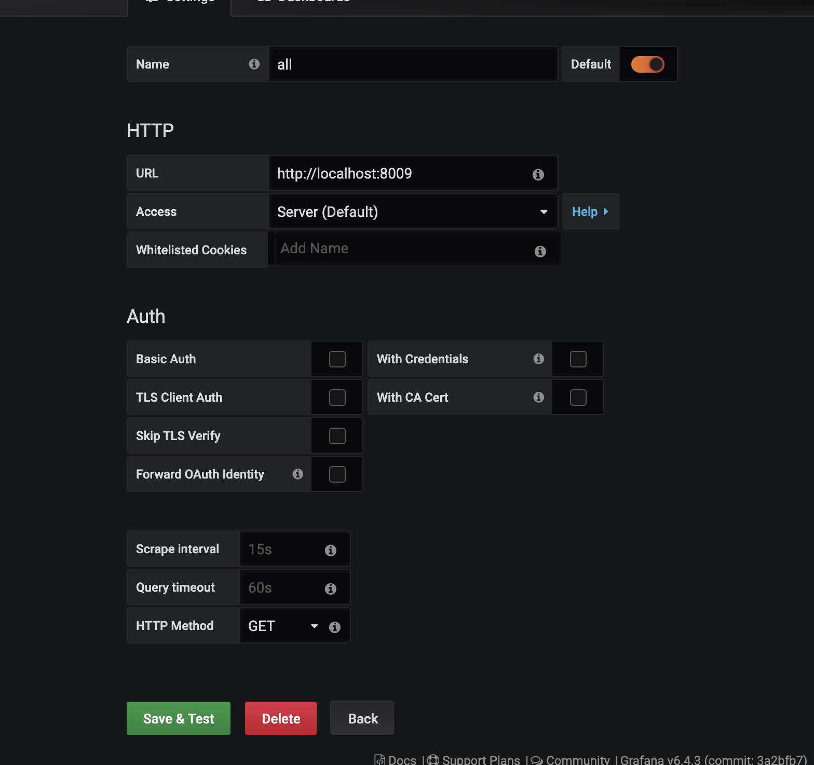

```
irate(response_time[1m])
irate(requests[1m])

rate(response_time[1m])
rate(requests[1m])
```

# РЕЗУЛЬТАТЫ
## Все поды включены
`ab -n 100000 -c 100 -i http://167.71.172.49/api/dummy`
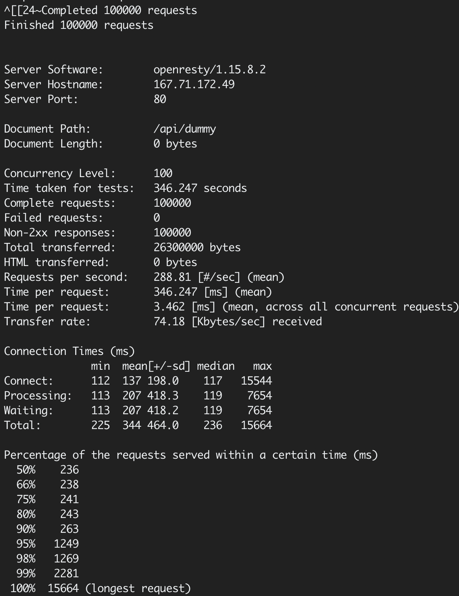


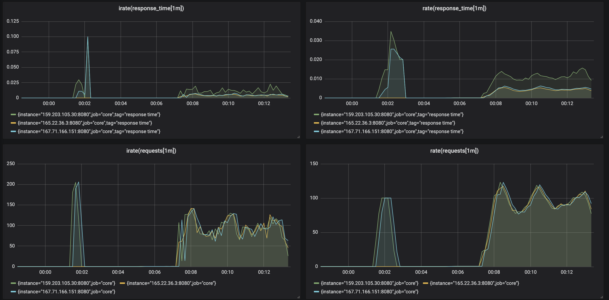

## Выключаем поду 165.22.36.3
`curl -X POST -Lv '165.22.36.3/api/turn'`

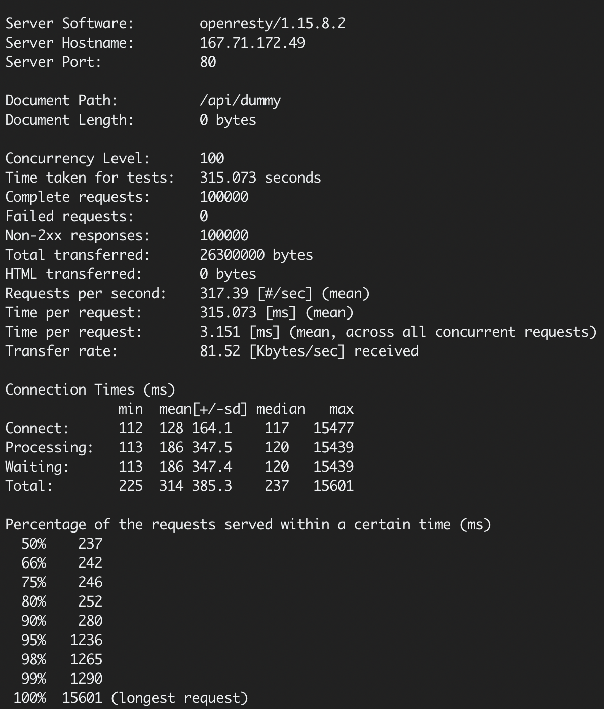
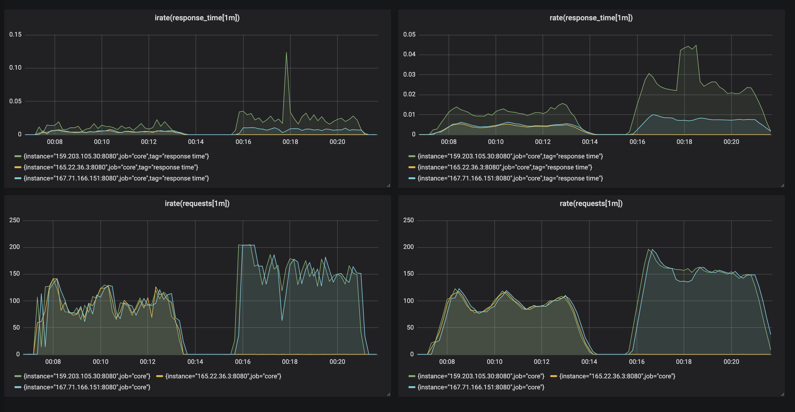

### Графики выключенной поды
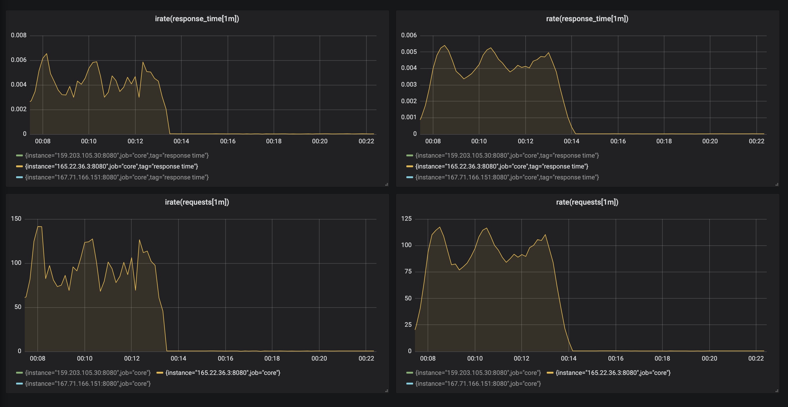


