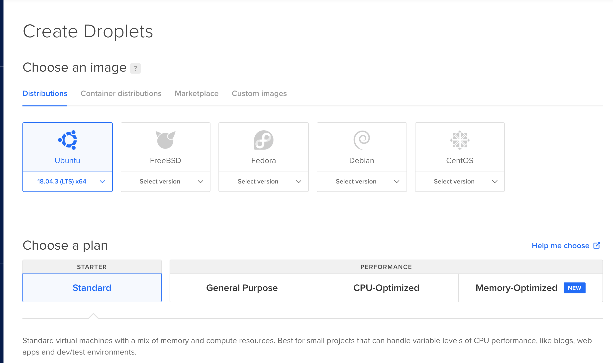

#highload
# Create droplets do



 
# Droplets


# Optional


# Prepare
Запускаем на каждой тачке сервер


*UPD забыл порт на prometheus* 
```
актуальная команда:
	docker run -d -p 5000:80 -p 8080:8080 back:latest
```


# nginx
Устанавливаем nginx на нужный дроплет
[Как установить Nginx в Ubuntu 18.04 | DigitalOcean](https://www.digitalocean.com/community/tutorials/nginx-ubuntu-18-04-ru)

## conf
```
user www-data;
worker_processes auto;
pid /run/nginx.pid;
include /etc/nginx/modules-enabled/*.conf;

events {
    worker_connections 768;
}

http {
    upstream backend {
        server 167.71.166.151:5000 max_fails=2 fail_timeout=10s;
        server 159.203.105.30:5000 max_fails=2 fail_timeout=10s;
        server 165.22.36.3:5000 max_fails=2 fail_timeout=10s;
    }

    server {
        listen 80;
        location / {
            proxy_set_header Host $host;
            proxy_set_header X-Real-IP $remote_addr;
            proxy_pass http://backend;
        }
    }


    sendfile on;
    tcp_nopush on;
    tcp_nodelay on;
    keepalive_timeout 65;
    types_hash_max_size 2048;
    include /etc/nginx/mime.types;
    default_type application/octet-stream;

    ssl_protocols TLSv1 TLSv1.1 TLSv1.2; # Dropping SSLv3, ref: POODLE
    ssl_prefer_server_ciphers on;

    access_log /var/log/nginx/access.log;
    error_log /var/log/nginx/error.log;

    gzip on;

    include /etc/nginx/conf.d/*.conf;
    include /etc/nginx/sites-enabled/*;
}
```

# prometheus
Запускаем на тачке с nginx docker-compose командой ./run.sh
Если что `chmod +x run.sh`
(Больше ничего не надо, кроме изменения адресов в prometheus.yaml)

### Например, мой конфиг
```
global:
  scrape_interval:     10s
  evaluation_interval: 10s

scrape_configs:
  - job_name: 'core'
    static_configs:
            - targets: ['165.22.36.3:8080', '159.203.105.30:8080', '167.71.166.151:8080']
```

#  grafana
Устанавливаем графану на тачку с nginx
[Installing on Debian / Ubuntu | Grafana Documentation](https://grafana.com/docs/installation/debian/)
[Grafana](http://167.71.172.49:3000/)


```
irate(response_time[1m])
irate(requests[1m])
```


# проверяем
`ab -n 100000 -c 100 -i http://167.71.172.49/api/dummy`


# отключаем тачку


# отключаем
`curl -X POST -Lv '167.71.166.151:5000/api/turn'`

# конфиг бэкендов
```
root@ubuntu-lb-0:~# cat /etc/nginx/nginx.conf
user www-data;
worker_processes auto;
pid /run/nginx.pid;
include /etc/nginx/modules-enabled/*.conf;

events {
    worker_connections 768;
}

http {
	upstream backend {
        	server 127.0.0.1:5000;
	}

	upstream metrics {
        	server 127.0.0.1:8080;
	}

	server {
		listen 80;
		location /metrics {
			proxy_set_header Host $http_host;
                	proxy_set_header X-Real-IP $remote_addr;
	                proxy_pass http://metrics;
		}

		location / {
                	proxy_set_header Host $http_host;
	                proxy_set_header X-Real-IP $remote_addr;
	                proxy_pass http://backend;
	        }
	}
	##
	# Basic Settings
	##

	sendfile on;
	tcp_nopush on;
	tcp_nodelay on;
	keepalive_timeout 65;
	types_hash_max_size 2048;
	# server_tokens off;

	# server_names_hash_bucket_size 64;
	# server_name_in_redirect off;

	include /etc/nginx/mime.types;
	default_type application/octet-stream;

	##
	# SSL Settings
	##

	ssl_protocols TLSv1 TLSv1.1 TLSv1.2; # Dropping SSLv3, ref: POODLE
	ssl_prefer_server_ciphers on;

	##
	# Logging Settings
	##

	access_log /var/log/nginx/access.log;
	error_log /var/log/nginx/error.log;

	##
	# Gzip Settings
	##

	gzip on;

	# gzip_vary on;
	# gzip_proxied any;
	# gzip_comp_level 6;
	# gzip_buffers 16 8k;
	# gzip_http_version 1.1;
	# gzip_types text/plain text/css application/json application/javascript text/xml application/xml application/xml+rss text/javascript;

	##
	# Virtual Host Configs
	##

	include /etc/nginx/conf.d/*.conf;
	include /etc/nginx/sites-enabled/*;
}
```